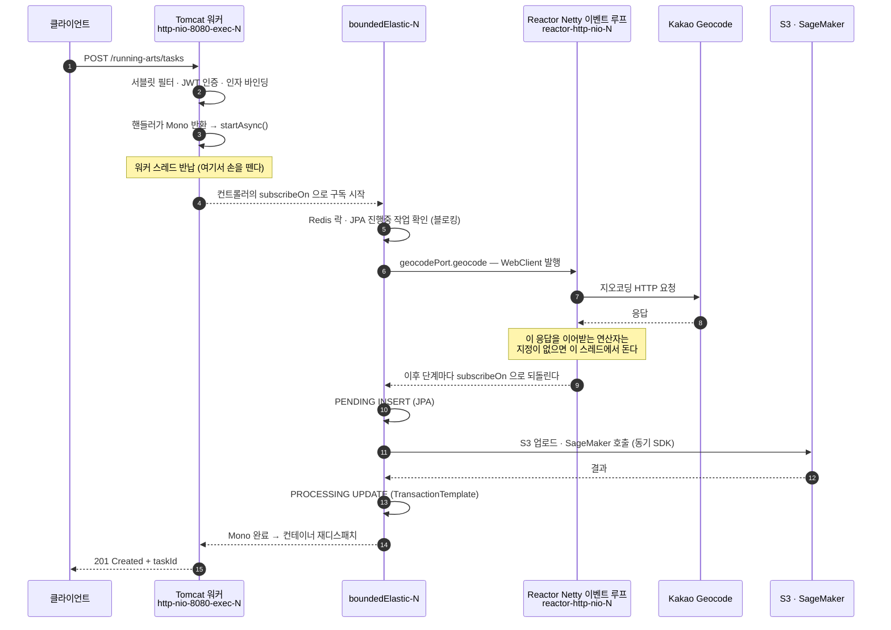

# 서블릿 스택 위의 Reactor — 이 서버는 Tomcat에서 돈다

> 요약 · [README — 기술 스택](../../README.md#기술-스택)
> 함께 · [01. 리액티브 파이프라인의 블로킹 I/O](../troubleshooting/01-reactive-blocking-io.md)
> 근거 · [`ServerBeApplication.java`](../../src/main/java/com/serverbe/ServerBeApplication.java) · [`WebClientConfig.java`](../../src/main/java/com/serverbe/infrastructure/config/WebClientConfig.java) · [`AuthController.java`](../../src/main/java/com/serverbe/adapter/in/web/AuthController.java) · [`build.gradle`](../../build.gradle)

## 0. 한 줄 답

**이 서버는 Tomcat(서블릿 스택) 하나만 띄웁니다.** Netty는 서버로 뜨지 않습니다.
`spring-boot-starter-webflux`는 **`WebClient`와 Reactor 타입(`Mono`/`Flux`)을 쓰기 위한 라이브러리**로만
들어와 있고, Reactor Netty는 **아웃바운드 HTTP 클라이언트**로만 동작합니다.

컨트롤러가 `Mono`를 반환하는 것은 WebFlux 라우트라서가 아니라, **Spring MVC가 리액티브 반환 타입을
비동기 서블릿으로 어댑팅**해 주기 때문입니다. 인바운드 어댑터는 전부 `@RestController` 하나이고,
리액티브 서버·`RouterFunction`·`@EnableWebFlux`는 이 저장소에 **한 줄도 없습니다.**

### 0-1. 예상 질문과 답

이 구성은 흔치 않아서 "그래서 뭐 위에서 도는 건가요"를 반드시 묻습니다. 소리 내어 읽으면 그대로
답이 되도록 적어 둡니다.

**Q1. 서버가 Tomcat에서 도나요, Netty에서 도나요?**
Tomcat 하나입니다. 기동 로그에 `Tomcat started on port 8080`만 찍히고 Netty 서버 로그는 없습니다.
Netty는 `WebClient` 밑에 깔린 **전송 계층**으로만 존재합니다 — `WebClientConfig`가 만드는
`ReactorClientHttpConnector`가 그것이고, 이름 그대로 클라이언트입니다.

**Q2. 그럼 둘 다 띄운 건가요? 띄웠다면 어떻게 띄웠나요?**
아니요, HTTP 서버는 하나입니다. 둘을 나란히 띄우려면 리액티브 쪽 `HttpHandler`와 웹 서버 팩토리를
수동으로 구성해 별도 포트에 붙여야 하는데, 그런 코드는 이 저장소에 없습니다. **안 한 이유**는 §6에 있습니다 —
얻는 것이 "Netty에서도 돈다"뿐인데 운영·모니터링·보안 설정이 두 벌이 됩니다.

**Q3. 그러면 WebFlux 의존성은 왜 넣었나요?**
두 가지 때문입니다. `WebClient`(논블로킹 아웃바운드 HTTP 클라이언트)와, Reactor 연산자
(`timeout`, `zipWhen`, `onErrorResume` 기반 보상 체인, Resilience4j의 `CircuitBreakerOperator`)입니다.
AI 파이프라인은 지오코딩 → S3 → SageMaker를 순차로 기다리면서 중간 실패마다 앞 단계를 되돌려야 해서,
이 보상 흐름을 연산자로 조립한 것이 명령형으로 쓰는 것보다 짧았습니다.

**Q4. 컨트롤러가 `Mono`를 반환하던데, 그건 WebFlux 아닌가요?**
아닙니다. Spring MVC도 리액티브 반환 타입을 지원합니다. `ReactiveTypeHandler`가 `Publisher`를
`DeferredResult`로 어댑팅하고 `request.startAsync()`로 **비동기 서블릿**을 시작합니다.
그래서 같은 컨트롤러 클래스 안에 `Mono`를 반환하는 메서드와 그냥 `ResponseEntity`를 반환하는
메서드가 섞여 있습니다 — `AiGenerationController`가 그렇습니다.

**Q5. 그렇게 해서 뭐가 좋아지나요?**
처리량이 아니라 **점유 해제**가 이득입니다. 외부 API를 기다리는 몇 초 동안 톰캣 워커 스레드를
붙잡지 않습니다. 동기 코드였다면 AI 요청 동시 N건이 워커 N개를 그 시간 내내 묶습니다.
반대로 DB만 만지는 CRUD는 굳이 `Mono`로 만들지 않았습니다. 기다릴 외부가 없으면 이득도 없습니다.

**Q6. "이벤트 루프가 막힌다"면 서버 전체가 멈추는 건가요?**
아닙니다. 막히는 것은 `reactor-http-nio-*`이고, 그 피해 반경은 **애플리케이션의 모든 아웃바운드
외부 API 호출**입니다 — 카카오·구글 OAuth, 지오코딩, Discord 웹훅. 인바운드를 받는 것은 톰캣 워커
(기본 최대 200)라서, 순수 동기 엔드포인트는 이벤트 루프가 굳어도 계속 응답합니다.
이 구분을 흐리면 실제보다 과장한 설명이 됩니다.

**Q7. 리액티브를 반쯤만 쓰는 건 어정쩡하지 않나요?**
의도한 선택입니다. 병목은 처리량이 아니라 **외부 API 대기 시간**이었고, 인바운드 쪽 자산
(JPA·Querydsl, 서블릿 시큐리티 필터, `SseEmitter`, springdoc-webmvc)은 전부 서블릿에 묶여 있습니다.
대가는 분명합니다 — **스레드 모델이 하나가 아니라 셋**이라 어느 코드가 어느 스레드에서 도는지를
계속 의식해야 하고, 그 규율을 놓쳤을 때가 [01번 문서](../troubleshooting/01-reactive-blocking-io.md)의 장애입니다.

이 문서는 그 근거와, 그래서 실제로 스레드가 어떻게 흐르는지를 정리합니다.

## 1. 왜 Tomcat인가 — Spring Boot의 선택 규칙

`build.gradle`에는 두 스타터가 함께 있습니다.

```groovy
// Spring Web: RESTful API 개발을 위한 표준 MVC 프레임워크 (Tomcat 내장)
implementation 'org.springframework.boot:spring-boot-starter-web'
// Spring WebFlux: 서버로 띄우지 않습니다. WebClient 와 Reactor 타입(Mono/Flux)을 쓰기 위한 의존성입니다.
implementation 'org.springframework.boot:spring-boot-starter-webflux'
```

Spring Boot는 기동 시 클래스패스를 보고 **웹 애플리케이션 타입을 하나만** 고릅니다
(`WebApplicationType.deduceFromClasspath`). 규칙은 단순합니다.

- 리액티브 `DispatcherHandler`가 있고 `DispatcherServlet`이 **없으면** → `REACTIVE`
- 서블릿 클래스가 있으면 → `SERVLET`

**둘 다 있으면 서블릿이 이깁니다.** `spring-boot-starter-web`이 있는 한 이 서버는 서블릿 스택입니다.
어느 쪽 스타터에도 `exclude`가 걸려 있지 않고, `spring.main.web-application-type`으로 강제한 곳도 없습니다.
그 결과 `WebFluxAutoConfiguration`은 활성화되지 않고, 내장 Netty 서버도 기동되지 않습니다.
`spring-boot-starter-webflux`가 남기는 실질적 산물은 **`WebClient`와 `reactor-netty` 클라이언트,
그리고 Reactor 코어**뿐입니다.

### 1-1. 코드가 남긴 증거

말이 아니라 코드로 확인되는 것들입니다. 리액티브 서버였다면 하나도 성립하지 않습니다.

| 증거 | 무엇을 증명하나 |
| --- | --- |
| 빌드 산출물 `app.jar`의 `BOOT-INF/lib/`에 `tomcat-embed-core` | 서블릿 컨테이너가 실제로 패키징돼 있습니다. `reactor-netty-http`도 함께 들어 있지만 그쪽은 `WebClient`가 쓰는 클라이언트입니다. |
| `WebClientConfig`가 만드는 `ReactorClientHttpConnector` | 이 저장소에서 Reactor Netty가 생성되는 **유일한 지점**이고, 타입 이름부터 커넥터(클라이언트)입니다. |
| `AuthController.loginCallback(..., HttpServletResponse response)` | 서블릿 API를 컨트롤러 파라미터로 직접 주입받습니다. WebFlux에서는 불가능합니다. |
| `JwtAuthenticationFilter extends OncePerRequestFilter` | 서블릿 필터입니다. 리액티브였다면 `WebFilter`여야 합니다. |
| `SecurityConfig`의 `SecurityFilterChain`·`HttpSecurity` | 서블릿 시큐리티입니다. 리액티브는 `SecurityWebFilterChain`·`ServerHttpSecurity`를 씁니다. |
| `SseController`의 `SseEmitter` | Spring MVC 전용 SSE 타입입니다. WebFlux는 `Flux<ServerSentEvent>`를 쓰는데, 그 타입은 저장소에 0건입니다. |
| `springdoc-openapi-starter-webmvc-ui` | Swagger UI 스타터부터가 **webmvc** 변형입니다. |
| `RouterFunction`·`@EnableWebFlux`·`HandlerFunction`·`WebServerFactory` 검색 결과 0건 | 리액티브 라우트나 서버 팩토리를 수동 구성한 곳이 없습니다. |

`ServerBeApplication`의 클래스 주석이 이 구성을 **Semi-Reactive**라고 부르는 것도 같은 뜻입니다.
서블릿 스택을 기반으로 두고, 외부 통신 구간에만 Reactor를 결합했다는 의미입니다.

## 2. 그럼 `Mono`를 반환하는 컨트롤러는 무엇인가

Spring MVC는 **리액티브 반환 타입을 지원합니다.** 이것이 "WebFlux를 띄웠다"와 혼동되기 쉬운 지점입니다.

```java
// AiGenerationController.java
@PostMapping
public Mono<ResponseEntity<RestApiResponse<String>>> initiateGeneration(...) {
    return initiateAiGenerationUseCase.initiateGeneration(...)
            .subscribeOn(Schedulers.boundedElastic())
            .map(taskId -> ResponseEntity.status(HttpStatus.CREATED).body(RestApiResponse.created(taskId)));
}
```

핸들러가 단일 값 `Publisher`를 반환하면 Spring MVC의 `ReactiveTypeHandler`가 이를 `DeferredResult`로
어댑팅하고 **서블릿 비동기 처리(`request.startAsync()`)를 시작**합니다. 실제로 일어나는 일은 이렇습니다.

1. Tomcat 워커 스레드(`http-nio-8080-exec-*`)가 요청을 받아 필터·인증·인자 바인딩까지 처리합니다.
2. 핸들러가 `Mono`를 반환하면 MVC가 구독하고 **비동기 모드로 전환**한 뒤, **워커 스레드를 반납**합니다.
3. 체인은 다른 스레드(`boundedElastic-*` 또는 `reactor-http-nio-*`)에서 진행됩니다.
4. `Mono`가 값을 방출하면 컨테이너가 **다시 디스패치**해 응답을 씁니다.

즉 `Mono` 반환의 실익은 "Netty 서버"가 아니라 **외부 API를 기다리는 동안 톰캣 스레드를 붙잡지 않는 것**입니다.
AI 생성 요청 하나는 지오코딩 → S3 → SageMaker를 순차로 기다리므로, 동기 코드였다면 그 시간 내내
톰캣 스레드 하나가 묶여 있게 됩니다.

`RunningArtController`를 보면 두 방식이 한 클래스 안에 섞여 있는 것이 그대로 드러납니다 —
DB만 만지는 CRUD는 `ResponseEntity`를 **그냥 반환**(동기, 톰캣 스레드에서 종료)하고,
Redis GEO 조회와 배치 페치가 섞인 `getNearbyArts`만 `Mono<ResponseEntity<...>>`입니다.
`AiGenerationController`도 마찬가지로 작업 상태 조회(`checkTaskStatus`)는 동기입니다.
**엔드포인트 단위로 동기·비동기를 고른 것이지, 스택을 나눈 것이 아닙니다.**

## 3. 요청 한 건이 지나가는 스레드

AI 생성 요청(`POST /api/v1/running-arts/tasks`)의 실제 스레드 이동입니다. 넓은 판본은
[`docs/assets/servlet-and-reactor-threads-light.svg`](../assets/servlet-and-reactor-threads-light.svg)에 있습니다.



순서에 유의할 점이 하나 있습니다. 톰캣이 손을 뗀 **직후 곧바로 이벤트 루프로 넘어가지 않습니다.**
`AiGenerationController`가 체인 전체에 `subscribeOn(boundedElastic)`을 걸고,
`AiGenerationService.initiateGeneration`의 첫 단계가 `validateRequestEligibility`(Redis 락 + JPA 조회)이기
때문입니다. 이벤트 루프는 **지오코딩 응답을 받는 구간에서만** 등장합니다.

요청 경로에 존재하는 스레드 풀은 셋이고, 이름만으로 구분됩니다.

| 스레드 이름 | 정체 | 하는 일 | 크기 |
| --- | --- | --- | --- |
| `http-nio-8080-exec-*` | **Tomcat 워커** | 인바운드 HTTP 수신, 필터·인증, 동기 엔드포인트 전체 | 기본 최대 200 |
| `reactor-http-nio-*` | **Reactor Netty 이벤트 루프** | `WebClient` 아웃바운드 요청·응답 처리 | **CPU 코어 수** |
| `boundedElastic-*` | Reactor 블로킹 격리 풀 | JDBC·Redis·AWS SDK 등 블로킹 호출 | 코어 수 × 10 |

**"이벤트 루프"는 두 번째 줄 하나만 가리킵니다.** 인바운드 요청을 받는 스레드가 아닙니다.

여기에 더해, AI 결과가 돌아오는 **콜백 경로에는 스레드가 둘 더** 있습니다. 요청 경로와 완전히 분리돼 있어
같은 파이프라인인데도 시작과 끝이 다른 스레드입니다.

| 스레드 | 정체 | 하는 일 |
| --- | --- | --- |
| SQS 폴링 스레드 | spring-cloud-aws 리스너 컨테이너 | `AiNotificationSqsListener`가 SageMaker 완료 알림을 소비하고, JPA 저장까지 **동기로** 끝냅니다 |
| Redis 리스너 컨테이너 스레드 | Spring Data Redis Pub/Sub | `SseRedisMessageListener`가 알림을 받아 `SseEmitterRegistry`로 넘기고, **파킹돼 있던 톰캣 비동기 요청**에 이벤트를 씁니다 |

## 4. 그래서 "이벤트 루프 블로킹"의 사정거리

[01. 리액티브 파이프라인의 블로킹 I/O](../troubleshooting/01-reactive-blocking-io.md)가 다루는 장애를
이 구조 위에서 정확히 다시 쓰면 이렇습니다.

- **막히는 것** — `reactor-http-nio-*`. 코어 수만큼밖에 없고, 애플리케이션의 **모든 `WebClient`가 공유**합니다.
- **피해 반경** — "서버의 모든 요청"이 아니라 **모든 아웃바운드 외부 API 호출**입니다.
  카카오·구글 OAuth, 카카오 지오코딩, Discord 웹훅이 여기에 걸립니다.
- **안 막히는 것** — 순수 동기 엔드포인트(내 러닝 아트 조회 등)는 톰캣 워커 200개 위에서 돌기 때문에
  이벤트 루프가 굳어도 계속 응답합니다.

**"모든 `WebClient`가 공유한다"는 것은 추측이 아니라 구성의 결과입니다.** `WebClientConfig`가 등록하는
`WebClient.Builder` 빈은 하나이고, `KakaoGeocodeAdapter`·`KakaoOAuthAdapter`·`GoogleOAuthAdapter`·
`DiscordAlertAdapter` 네 어댑터가 전부 그 빈을 `clone()`해서 자기 인스턴스를 만듭니다.
`clone()`은 커넥터 설정을 그대로 물려받으므로 **네 어댑터가 같은 `HttpClient`, 곧 같은 전역 이벤트 루프
그룹을 씁니다.** 어댑터별로 루프를 나누려면 `HttpClient`를 따로 만들어 붙여야 하는데, 그러지 않았습니다.

문제의 심각성은 그대로입니다. 외부 호출이 전반적으로 느려지면 Resilience4j의 `slowCallRateThreshold`에
걸려 **상대 서버는 멀쩡한데 우리 쪽 서킷이 열리기** 때문입니다. 다만 메커니즘이 "서버 전체 정지"는
아니라는 점은 정확히 말해야 합니다.

## 5. 서블릿 스택이라서 지켜야 하는 네 가지

리액티브 체인을 서블릿 위에 얹었기 때문에 생기는 제약입니다. 넷 다 코드에 흔적이 남아 있습니다.

### 5-1. `SecurityContext`는 톰캣 스레드에만 있다

`JwtAuthenticationFilter`는 `SecurityContextHolder`(ThreadLocal)에 인증 정보를 넣습니다. 이 값은
**톰캣 워커 스레드에 묶여 있어** `boundedElastic`이나 이벤트 루프에서는 보이지 않습니다.

그래서 컨트롤러는 전부 `@AuthenticationPrincipal Long userId`처럼 **메서드 파라미터로 받아** 체인에
값으로 흘려보냅니다. 인자 바인딩은 아직 톰캣 스레드일 때 끝나므로 안전합니다.
반대로 체인 **내부에서** `SecurityContextHolder.getContext()`를 호출하면 비어 있습니다. 하지 않습니다.

### 5-2. `@Transactional`은 리액티브 체인 위에서 아무 일도 하지 않는다

선언적 트랜잭션도 스레드에 바인딩됩니다. `Mono`를 반환하는 메서드에 `@Transactional`을 붙이면
**메서드가 파이프라인 조립만 하고 즉시 반환**하므로, 실제 DB 작업이 실행되기도 전에 트랜잭션이 닫힙니다.

이 프로젝트는 이를 규약이 아니라 **테스트로 강제**합니다 —
`LayerDependencyTest`의 `트랜잭션_메서드는_리액티브_타입을_반환하지_않는다`가 클래스 레벨 애노테이션까지
검사합니다. 같은 테스트에 **리액티브 타입을 노출해도 되는 포트 8개의 화이트리스트**가 상수로 박혀 있어서,
새 포트가 조용히 `Mono`를 흘리기 시작하면 빌드가 깨집니다. 트랜잭션이 필요한 구간은
`AiGenerationService`처럼 `boundedElastic`으로 격리한 블록 **안에서** `TransactionTemplate`으로 명시적으로 엽니다.

### 5-3. 응답 쓰기는 비동기 완료 전에 끝나야 한다

`AuthController`는 `HttpServletResponse`에 리프레시 토큰 쿠키를 심는데, 그 호출이 `Mono`의 `map`
안에 있습니다.

```java
return Mono.fromCallable(() -> reissueUseCase.reissue(accessToken, refreshToken, deviceId))
        .subscribeOn(Schedulers.boundedElastic())
        .map(tokenResponse -> {
            addCookieToResponse(response, tokenResponse.refreshTokenResult().opaqueToken(), refreshTokenCookieExpireSeconds);
            return ResponseEntity.ok(...);
        });
```

비동기 서블릿 요청이 **아직 진행 중**이라 응답이 커밋되기 전이고, 그래서 다른 스레드에서 헤더를 추가해도
반영됩니다. 다만 이는 "`Mono`가 완료되기 전에 쓴다"는 조건에 의존합니다. 완료 이후에 응답 객체를
건드리면 `IllegalStateException`입니다.

### 5-4. `block()`을 허용한 곳은 둘뿐이고, 둘 다 조건부다

리액티브 체인 안에서 `block()`을 부르지 않는다는 규율에는 예외가 둘 있습니다. **숨길 것이 아니라
조건을 명시해 둘 문제**입니다.

| 위치 | 부르는 스레드 | 왜 안전한가 |
| --- | --- | --- |
| `RunningArtRegistrationService.registerFromPolyline` — Redis GEO 동기화 | SQS 폴링 스레드 | 애초에 블로킹 워커라 굶길 논블로킹 스레드가 없습니다 |
| `GeoIndexWarmUpService.warmUpGeoIndex` — 기존 GEO 키 초기화 | 기동 이벤트 스레드 | 초기화 완료를 보장한 뒤 적재로 넘어가야 하고, 트래픽 유입 이전입니다 |

전자의 Javadoc은 그 전제를 이렇게 못 박아 둡니다 — *"호출 경로가 바뀌어 이벤트 루프에서 불리게 되면
이 전제가 먼저 깨집니다."* 지금 안전한 이유가 **코드가 아니라 호출 경로**에 있다는 뜻이고,
그래서 이 두 곳은 호출자가 바뀔 때 함께 봐야 합니다. `.toFuture().get()`이나 `awaitSingle()`은 0건입니다.

또 하나 이름이 헷갈리는 곳이 있습니다. `SageMakerAsyncAdapter.invokeAsync`가 쓰는
`SageMakerRuntimeClient.invokeEndpointAsync(...)`에서 **"Async"는 SageMaker 엔드포인트의 추론 모드**이지
비동기 SDK 클라이언트가 아닙니다. 클라이언트 자체는 동기(블로킹)라서 `boundedElastic` 격리가 필요합니다.

## 6. 왜 이 구성인가

| 대안 | 기각 이유 |
| --- | --- |
| **순수 WebFlux (Netty 단독)** | JPA·Querydsl, `SseEmitter`, 서블릿 시큐리티 필터, springdoc-webmvc가 전부 재작성 대상입니다. R2DBC로 옮기면 `AttributeConverter` 기반 PII 암호화와 비관적 락부터 다시 설계해야 합니다. 얻는 처리량에 비해 파급이 지나칩니다. |
| **순수 MVC (`RestClient`·`RestTemplate`)** | 외부 대기가 수 초 단위인 AI 파이프라인에서 톰캣 스레드를 그대로 붙잡습니다. 동시 요청 수만큼 워커가 묶이고, 보상 트랜잭션(`onErrorResume`)·타임아웃·서킷브레이커를 Reactor 연산자 없이 다시 조립해야 합니다. |
| **MVC와 WebFlux 서버를 별도 포트로 동시 기동** | `HttpHandler`를 수동 구성하면 이론상 가능하지만, 얻는 것이 "Netty에서도 돈다"뿐입니다. 운영·모니터링·보안 설정이 두 벌이 됩니다. |
| **채택 — 서블릿 스택 + Reactor 클라이언트** | 인바운드는 검증된 서블릿 생태계(트랜잭션·시큐리티·SSE)를 그대로 쓰고, **외부 대기 구간만** 논블로킹으로 처리합니다. 대신 블로킹 코드가 리액티브 체인에 섞이지 않도록 `boundedElastic` 격리를 규율로 지켜야 합니다. |

**대가는 분명합니다.** 스레드 모델이 하나가 아니라 셋이고, 어느 코드가 어느 스레드에서 도는지를
계속 의식해야 합니다. 그 대가로 얻은 것이 "AI 요청이 톰캣 워커를 점유하지 않는 것"이고,
격리를 놓쳤을 때의 결과가 01번 문서의 장애입니다.

## 7. 직접 확인하는 법

```bash
# 1. 어떤 서버가 떴는지 — Tomcat 한 줄만 나오고 Netty 는 나오지 않는다
docker compose logs app | grep -iE "tomcat started|netty started"

# 2. 패키징 결과 — 서블릿 컨테이너가 실려 있고, netty 는 클라이언트로만 들어 있다
unzip -l build/libs/app.jar | grep -E "tomcat-embed-core|reactor-netty-http"

# 3. 스레드 이름으로 역할 확인 — 인바운드는 http-nio, 아웃바운드는 reactor-http-nio
docker compose logs app | grep -oE "(http-nio-[0-9]+-exec-[0-9]+|reactor-http-nio-[0-9]+|boundedElastic-[0-9]+)" | sort | uniq -c

# 4. 리액티브 서버 구성이 없다는 것 — 전부 0건이어야 한다
grep -rn "RouterFunction\|@EnableWebFlux\|HandlerFunction\|WebServerFactory\|web-application-type" src/main
```

## 8. 남은 과제

- **비동기 요청 타임아웃 미설정** — `spring.mvc.async.request-timeout`을 지정하지 않아 컨테이너 기본값에
  맡기고 있습니다. 지금은 `WebClient`의 5초 응답 타임아웃이 사실상 상한을 만들지만, `boundedElastic`
  구간이 길어지는 경우까지 막아 주지는 않습니다. 명시적으로 거는 편이 낫습니다.
- **BlockHound 부재** — 이벤트 루프 블로킹을 지금은 코드 리뷰로 막습니다. 테스트 소스셋에 BlockHound를
  붙이면 새로 추가된 블로킹 호출이 **테스트 실패로** 드러납니다. §5-4의 두 `block()`처럼 "호출 경로 덕분에
  안전한" 코드가 있는 이상, 경로가 바뀌는 순간을 잡아 줄 안전망이 필요합니다.
- **용어 정리** — 저장소 배지가 `Spring WebFlux`만 노출해 "리액티브 서버"로 읽힐 여지가 있었습니다.
  README 기술 스택 표에 **서블릿 스택 기반**임을 명시했고, `infra/` 문서와 `build.gradle` 주석의
  같은 표현도 함께 고쳤습니다.
