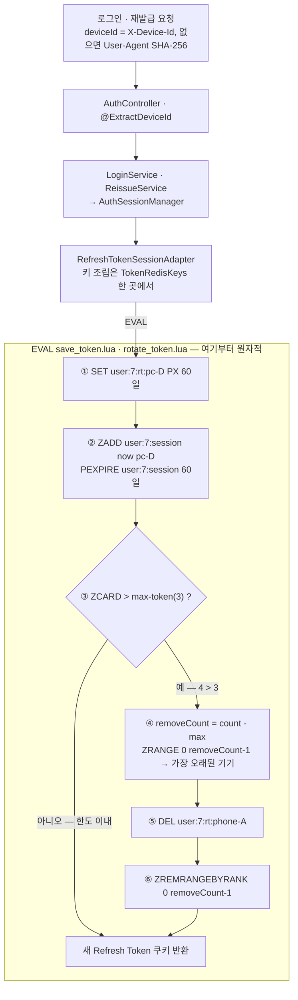

# 14. 다중 기기 세션 관리 — ZSet 인덱스와 LRU 자동 만료

> 요약 · [README — 6. Refresh Token Rotation](../../README.md#6-refresh-token-rotation--lua-원자적-회전과-기기별-세션-관리)
> 회전의 원자성 쪽 이야기 · [06. Refresh Token Rotation](06-refresh-token-rotation.md)
> 근거 · [`save_token.lua`](../../src/main/resources/scripts/save_token.lua) · [`rotate_token.lua`](../../src/main/resources/scripts/rotate_token.lua) · [`RefreshTokenSessionAdapter.java`](../../src/main/java/com/serverbe/adapter/out/persistence/token/RefreshTokenSessionAdapter.java) · [`TokenRedisKeys.java`](../../src/main/java/com/serverbe/adapter/out/persistence/token/TokenRedisKeys.java) · [`DeviceUtils.java`](../../src/main/java/com/serverbe/infrastructure/util/DeviceUtils.java)

## 1. 상황

한 계정은 여러 기기에서 동시에 로그인합니다. 그런데 Refresh Token의 수명은 **60일**(`jwt.refresh-token.expiration-days`)로,
Access Token(15분)과 비교하면 사실상 장기 자격증명입니다. 기기를 구분하지 않으면 새 기기에서 로그인할 때마다
이전 기기가 끊기거나(토큰 하나를 덮어씀), 반대로 유효한 장기 토큰이 계정당 무제한으로 늘어납니다.

그래서 세션을 **기기 단위로 쪼개고**, 동시에 살아 있는 기기 수에 상한을 둡니다. Redis에는 두 구조로 저장합니다.

| 구조 | 키 | 값 | 용도 |
| --- | --- | --- | --- |
| String | `user:{userId}:rt:{deviceId}` | Refresh Token | 기기별 토큰. **기기마다 독립 TTL** |
| ZSet | `user:session:{userId}` | member = `deviceId`, score = 저장·회전 시각(ms) | 기기 인덱스. 정렬이 곧 LRU 순서 |

키를 조립하는 곳은 [`TokenRedisKeys`](../../src/main/java/com/serverbe/adapter/out/persistence/token/TokenRedisKeys.java)
하나뿐입니다. 키 모양은 배포 사이에 지켜져야 하는 계약이라, 모양이 바뀌는 순간 살아 있던 세션이 전부 무효가 되기 때문입니다.

기기 식별자는 [`DeviceUtils.extractDeviceId`](../../src/main/java/com/serverbe/infrastructure/util/DeviceUtils.java)가 만듭니다.
`X-Device-Id` 헤더가 있으면 그 값(모바일 앱이 보내는 UUID), 없으면 `User-Agent`의 SHA-256 해시를 쓰고,
둘 다 없으면 `DE_IDENTIFIED_DEVICES`로 요청을 거절합니다. **기기를 식별할 수 없으면 세션을 만들지 않습니다.**

## 2. 증상 — 상한이 없거나, 있어도 애플리케이션이 세면

상한이 없을 때 남는 것은 "잊힌 세션"입니다. 로그아웃하지 않은 공용 PC의 브라우저, 중고로 판 폰,
잃어버린 태블릿이 전부 60일 동안 재발급 가능한 상태로 남습니다.

그렇다고 상한을 애플리케이션에서 강제하면 이런 순서가 됩니다.

```
ZCARD user:session:7      → 3      (한도 3 이내라고 판단)
SET   user:7:rt:pc-D ...           (4개째 저장)
```

두 기기가 거의 동시에 로그인하면 둘 다 `ZCARD`에서 3을 읽고 둘 다 저장합니다. 결과는 5개입니다.
"세보고 지운다"는 방식은 **세는 순간과 지우는 순간 사이가 비어 있습니다.**

한 가지 더 있습니다. 축출할 때 인덱스(ZSet)에서만 지우면 **토큰 키는 그대로 살아 있습니다.**
목록에서만 사라질 뿐 그 토큰으로는 계속 재발급이 됩니다. 축출이 반쪽이면 하지 않은 것과 같습니다.

## 3. 원인

Redis 명령 각각은 원자적이지만 `ZCARD → 판단 → ZRANGE → DEL → ZREMRANGEBYRANK`라는 **묶음은 원자적이지 않습니다.**
게다가 이 묶음은 중간 결과(`ZCARD` 값, `ZRANGE` 결과)에 따라 다음 명령이 달라지므로,
응답을 `EXEC` 시점에야 받는 `MULTI`/`EXEC`로는 표현할 수도 없습니다.

## 4. 검토한 대안

| 대안 | 기각 이유 |
| --- | --- |
| 애플리케이션이 세고 지운다 (`removeOldestSession`) | 위 경합이 그대로 남습니다. 게다가 이 메서드는 **한 번에 한 기기**만 지우므로 한도가 2개 이상 초과된 상태를 한 번에 정리하지 못합니다. |
| 기기별 키에 TTL만 걸고 상한은 두지 않는다 | 60일 안에는 아무것도 회수되지 않습니다. 잃어버린 기기의 세션이 그대로 살아 있습니다. |
| 한 사용자의 전 기기를 Hash 하나에 담는다 | Redis Hash는 **필드별 TTL이 없습니다.** 기기마다 만료가 달라야 하는데 키 하나로 묶으면 한 기기의 만료가 전부에 걸립니다. |
| 상한 초과 시 새 로그인을 거절한다(선착순) | 사용자가 스스로 풀 방법이 없습니다. 세션 목록 조회·삭제 화면이 있어야 성립하는 정책인데, 지금은 그 API가 없습니다. |
| RDB에 세션 테이블을 두고 트랜잭션으로 처리 | 재발급은 요청마다 쓰기가 일어나는 고빈도 경로입니다. 15분마다 전 사용자가 한 번씩 쓰는 테이블이 됩니다. |
| ZSet 대신 Set + 별도 시각 키 | 정렬을 애플리케이션이 해야 합니다. "가장 오래된 것 N개"는 ZSet이 `ZRANGE` 한 줄로 주는 답입니다. |

## 5. 해결

### 5-1. score를 시각으로 둔 ZSet — 정렬이 곧 LRU 순서

`ZADD user:session:{userId} now {deviceId}`로 기기를 등록합니다. score가 시각이므로 `ZRANGE 0 N-1`이
곧 **가장 오래 쓰지 않은 기기 N개**입니다. 별도의 정렬도, 애플리케이션 계산도 필요 없습니다.

score는 로그인뿐 아니라 **재발급 때도 현재 시각으로 갱신**됩니다. `rotate_token.lua`가 같은 `ZADD`를
실행하기 때문입니다. 그래서 이 인덱스는 "언제 로그인했나"가 아니라 **"마지막으로 토큰을 쓴 게 언제인가"**
순서로 유지됩니다. 자주 쓰는 기기는 계속 뒤로 밀리고 방치된 기기가 앞에 남습니다. 축출 대상이 LRU가 되는 이유입니다.

### 5-2. 축출까지 한 스크립트 안에서

저장(`save_token.lua`)과 회전(`rotate_token.lua`)이 **같은 축출 블록**을 가집니다. 로그인으로 들어오든
재발급으로 들어오든 한도는 같은 코드로 강제됩니다.

```lua
local count = redis.call('ZCARD', KEYS[1])
local max = tonumber(ARGV[6])

if count > max then
    local removeCount = count - max
    local oldestDevices = redis.call('ZRANGE', KEYS[1], 0, removeCount - 1)

    for _, oldDeviceId in ipairs(oldestDevices) do
        local oldTokenKey = ARGV[7] .. oldDeviceId
        redis.call('DEL', oldTokenKey)                            -- 토큰 키 자체를 지운다
    end
    redis.call('ZREMRANGEBYRANK', KEYS[1], 0, removeCount - 1)    -- 인덱스에서도 지운다
end
```

세 가지가 여기에 들어 있습니다.

- **`removeCount = count - max`** — 하나가 아니라 초과분 전부를 지웁니다. 한도를 낮추는 설정 변경 직후처럼
  여러 개가 한꺼번에 넘치는 경우도 한 번의 로그인으로 정리됩니다.
- **`ARGV[7]`(토큰 키 접두사)** — 스크립트는 인덱스에서 `deviceId`만 읽을 수 있으므로 토큰 키를 직접
  재조립해야 합니다. 그래서 `TokenRedisKeys.tokenPrefix`가 조립 규칙의 절반(`user:{userId}:rt:`)을 넘겨 줍니다.
- **`DEL`과 `ZREMRANGEBYRANK`를 함께** — 인덱스와 실제 토큰을 같은 원자 구간에서 지웁니다.
  둘 중 하나만 지워진 중간 상태가 존재할 수 없습니다.

`ZADD`가 `ZCARD`보다 **먼저** 실행되는 순서도 의도된 것입니다. 새 기기를 먼저 등록해 두고 세기 때문에
비교 시점의 개수는 항상 "방금 로그인한 기기를 포함한 수"이고, 그래서 축출되는 것은 언제나 가장 오래된 기기입니다.

### 5-3. 인덱스에도 수명을 준다

`ZADD` 다음에는 항상 `PEXPIRE KEYS[1] ARGV[5]`(= Refresh Token 최대 수명, 60일)가 붙습니다.
인덱스에 TTL이 없으면 사용자가 다시 로그인하지 않는 한 그 키는 영원히 남습니다.
토큰은 60일 뒤 사라지는데 인덱스만 남아 메모리를 차지하는 상태를 막습니다.

### 5-4. 전체 흐름

로그인·재발급 요청이 들어와 축출까지 이어지는 경로입니다. 넓은 판본은
[`docs/assets/multi-device-session-lru-light.svg`](../assets/multi-device-session-lru-light.svg)에 있습니다.



## 6. 검증

- **인덱스와 토큰 키가 함께 줄었는지** — 한쪽만 줄었다면 축출이 반쪽입니다. 한도(기본 3)를 넘겨 로그인한 뒤
  둘을 같이 봅니다.

  ```bash
  docker compose exec redis redis-cli ZRANGE "user:session:7" 0 -1 WITHSCORES
  docker compose exec redis redis-cli --scan --pattern 'user:7:rt:*'
  ```
- **축출 순서가 LRU인지** — 세 기기로 로그인한 뒤 1번 기기만 재발급을 한 번 돌리고 네 번째 기기로 로그인합니다.
  score가 갱신된 1번이 아니라 **2번 기기**가 사라져야 합니다.
- **원자성** — `MONITOR`에 `EVALSHA` 한 줄로 나타나고, 그 사이에 다른 클라이언트의 명령이 끼어들지 않습니다.

  ```bash
  docker compose exec redis redis-cli MONITOR
  ```
- **키 모양 회귀** — [`RefreshTokenSessionAdapterTest`](../../src/test/java/com/serverbe/adapter/out/persistence/token/RefreshTokenSessionAdapterTest.java)가
  실제 `TokenRedisKeys` 인스턴스로 `KEYS`와 `ARGV`(TTL·`max-token`·토큰 키 접두사)를 고정합니다.

  ```bash
  ./gradlew test --tests "*RefreshTokenSessionAdapterTest"
  ```

## 7. 남은 과제

- **축출된 기기의 재발급이 전역 로그아웃을 부릅니다.** 축출로 토큰 키가 사라진 기기가 나중에 재발급을 시도하면
  [`ReissueService`](../../src/main/java/com/serverbe/application/service/ReissueService.java)의 세션 대조가
  실패하고, 이는 토큰 재사용 공격과 구분되지 않아 `handleSecurityBreach` → 전 기기 로그아웃으로 이어집니다.
  보안 쪽으로 기운 기본값이지만, **정상 사용자가 네 번째 기기로 로그인했다는 이유로 나머지 기기까지 로그아웃되는
  경로**가 존재합니다. 축출 사실을 짧은 마커로 남겨 "축출됨"과 "탈취 의심"을 구분해야 합니다.
- **세션 목록 조회·삭제 API가 없습니다.** 포트에는 `getAllDeviceIds`·`getSessionCount`·`removeOldestSession`이
  있지만 프로덕션 호출자가 없습니다(축출은 전부 Lua 안에서 일어납니다). 사용자가 자기 기기 목록을 보고 고르는
  화면이 없으니 "선착순 거절" 같은 다른 정책으로 바꿀 수도 없습니다.
- **`removeOldestSession`은 Lua 축출과 중복되는 비원자적 경로**로 남아 있습니다. 세션 목록 API를 만들 때
  이 메서드를 살릴지, 지우고 스크립트 하나로 통일할지 정해야 합니다.
- **`redis.auth.max-token`이 환경변수로 노출되어 있지 않습니다.** `application.yml`에 3으로 박혀 있고
  CDK(`infra/lib/app-stack.ts`)도 이 값을 주입하지 않으므로, 한도를 바꾸려면 재빌드가 필요합니다.
- **`ZCARD`가 활성 세션 수와 정확히 같지는 않습니다.** 인덱스는 어느 기기든 로그인·재발급할 때마다 60일로
  연장되는 반면 기기별 토큰 키는 각자의 TTL로 만료되므로, 토큰이 이미 만료된 기기가 인덱스에 남을 수 있습니다.
  이 유령 항목은 가장 오래된 쪽에 모이므로 다음 축출에서 먼저 정리되어 실사용에는 문제가 없지만,
  `getSessionCount`를 사용자에게 그대로 보여 주면 실제보다 큰 수를 말하게 됩니다.
